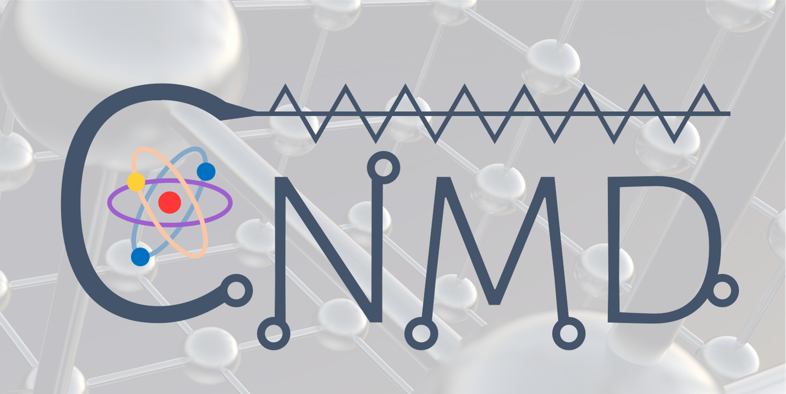

<h2>✨ Welcome to CNMD!</h2>

Computational Nano-Materials Design Laboratory (CNMD) GitHub Organization!

 

<h2>👀 About CNMD:</h2>

We are the **CNMD**, a research group in the Department of Materials Science and Engineering at **POSTECH**, located in Pohang, South Korea. 

- **Location**   : Pohang, South Korea  
- **University**: POSTECH (Pohang University of Science and Technology)  
- **Contact**   : [donghwa96@postech.ac.kr](mailto:donghwa96@postech.ac.kr)  
- **Website**   : [https://cnmd.postech.ac.kr](https://cnmd.postech.ac.kr)  

<h2>📚 Our Research Publications with Code</h2>

- Eun Ho Kim, Jun Hyeong Gu, June Ho Lee, Seong Hun Kim, Jaeseon Kim, Hyo Gyeong Shin, Shin Hyun Kim, Donghwa Lee.  
  Boosting–crystal graph convolutional neural network for predicting highly imbalanced data: a case study for metal-insulator transition materials.  
  _ACS Appl. Mater. Interfaces_, **16**(33), 43734-43741 (2024).  
  [DOI: 10.1021/acsami.4c07851](https://pubs.acs.org/doi/10.1021/acsami.4c07851)  
  **Related Code**: [GB-CGCNN](https://github.com/CNMD-POSTECH/GB-CGCNN)

  

    
  

<h2>📊 Research Metrics</h2>

  <b>Google Scholar Statistics:</b> 
  

